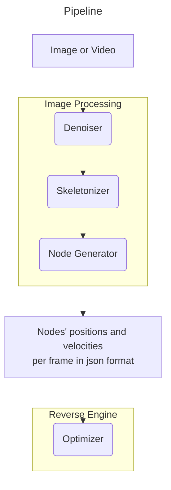

# web-physics-tuner
Python tool optimizing soft-body physics (ropes, banners) for web games. 
Uses AI tuning to generate lightweight JSON configs, ensuring 60fps performance 
without runtime ML overhead. Simulates mass-spring systems with Verlet integration. 
Auto-tunes stiffness/damping to match target motion. Exports production-ready config files.

